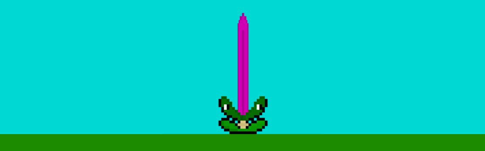
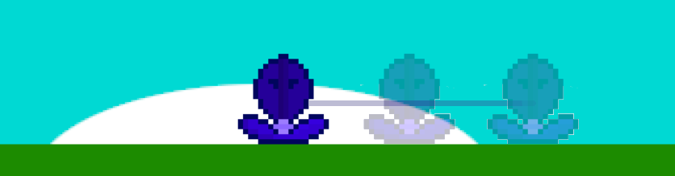
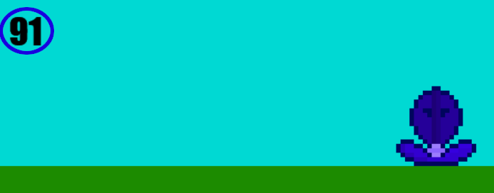
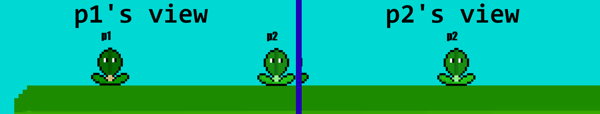
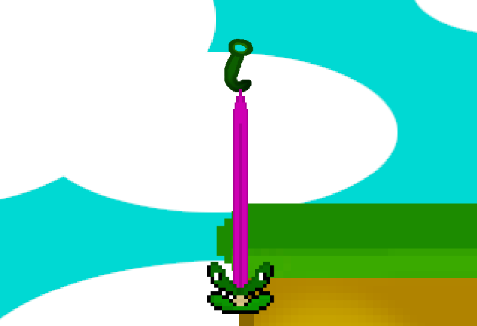
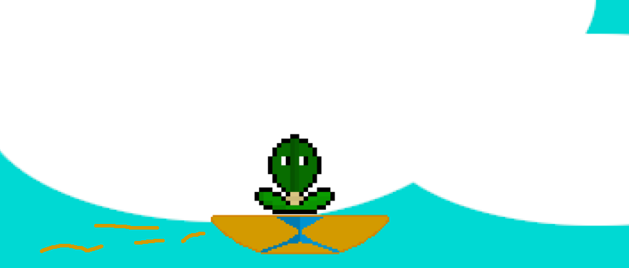
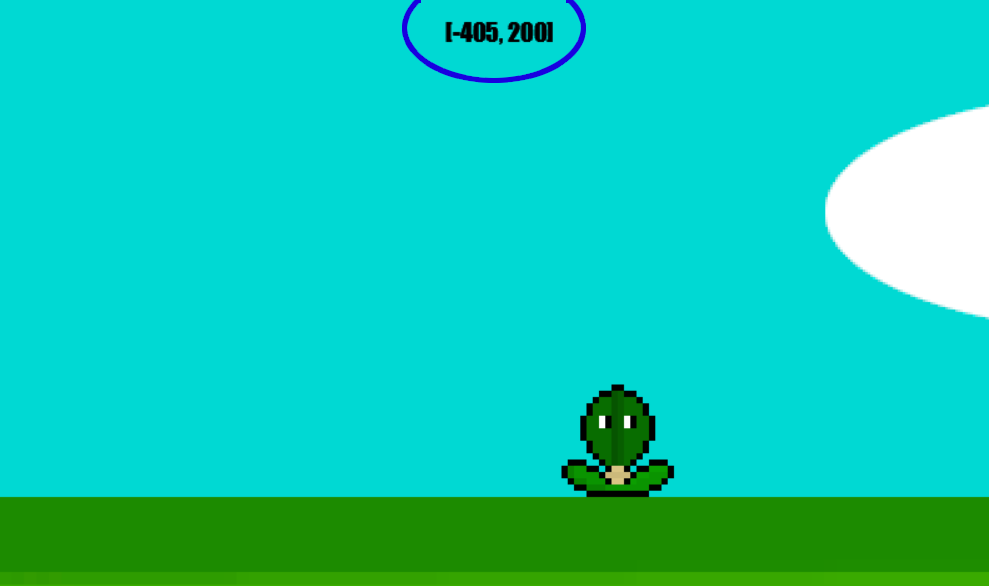
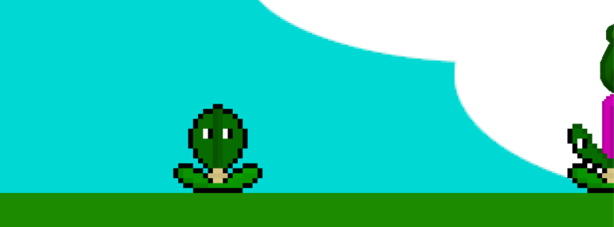

# Start the game

To start the game, all you have to do is launch the `start.bat` file.
There might be some issues anymay :

- You have to install pyglet with `pip install pyglet` in a cmd.
- If you have your python installed from the Microsoft Store, then the starting command isn't `py` but `python`.
  -> In that case just change it in the `start.bat`

# How to play

## Basic controls

There's currently two players, one moving with Q and D and the other with the arrows.
You can change the keys in the json, and add players by adding elements in the `players` property.

To take out the tongue, press Z (player 1) \
or the up arrow (player 2)

The tongue will expand more and more while you are pressing Z, but there's a limit of course.

## Rewind

You can also return in your previous positions, by pressing A or the down arrow (depending on the player)

*Please note that the visual effect is not actually in the game, the screen is manually modified to make you understand precisely the effect*

Doing that will make you able to return in a plateform is you fell, for example

While you are doing that, you can see the number of positions that remain.

## Change view

You can change the player's view that is rendered by pressing and holding M.

# Game Presentation

You control a living plant that can pick up or interact with things with its tongue.

## Hooks

You can interact with these "hooks" by touching them with the tongue

If you do that, then the player will go up to the hook, allowing you to go on the plateform above.

## Falling Plateforms

Some plateforms fall. There's no visible differencies between the ones that fall and the others, because it's a test level !

Just go on them and they will fall.

## Moving Plateforms

Some objects or plateforms can move from a point A to a point B.

*Please note again that the yellow particles don't exist in the game*

The player will however not move with these, meaning that you have to go forwards with them.

# UI

You can see your current coordinates at the top of the screen (That shows the coordinates of the player currently focused)

# Other notes

## Bugs

- There might be some collision bugs with the players. I don't really know if I actually fixed it so don't be surprised. Please note that you can use your rewind ability if that happens.

- Before, I played a music from youtube when you were playing the game. For some reason unknown yet, once the song is finished, the game crashes. If you prefer having a music but crashing, add in the line `123` from `main.py` :
`pyglet.clock.schedule_interval(ground_music.play(), ground_music.duration)`

*Please note that it may run instable if done*

## Camera

The camera follows only one player. The others can go out of the screen, but the objects and plateforms **entirely out** won't work, due to performance reasons.

